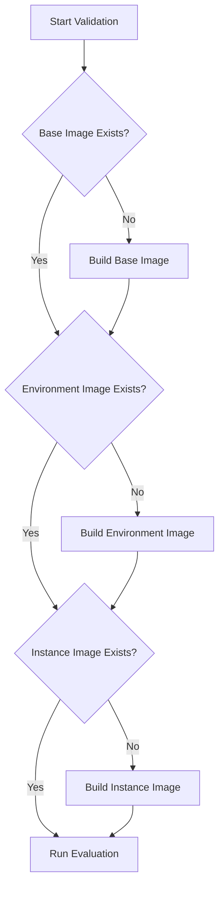

# SWE-bench Docker Architecture

## Overview

SWE-bench uses a sophisticated 3-layer Docker architecture to provide isolated, reproducible environments for evaluating AI-generated patches against real-world software engineering tasks. This document explains how Docker containers are used throughout the evaluation process.

## Table of Contents

1. [Three-Layer Docker System](#three-layer-docker-system)
2. [Image Building Process](#image-building-process)
3. [Test Execution Flow](#test-execution-flow)
4. [Integration with Validator](#integration-with-validator)
5. [Dependency Installation](#dependency-installation)
6. [Concrete Examples](#concrete-examples)

---

## Three-Layer Docker System

SWE-bench uses a hierarchical caching system with three layers of Docker images:

### Layer 1: Base Images

**Purpose**: Provides the foundational Python environment

**Naming**: `sweb.base.py.{arch}:latest` (e.g., `sweb.base.py.x86_64:latest`)

**Contents**:
- Base operating system (Ubuntu/Debian)
- Python runtime (version specified in data point)
- System-level dependencies
- Common build tools (gcc, make, etc.)

**Caching**: Built once per architecture and Python version, reused across all repositories

**Build Time**: ~5-10 minutes on first build, cached thereafter

**Example**:
```dockerfile
FROM ubuntu:20.04
RUN apt-get update && apt-get install -y python3.10 gcc make git
# ... additional system packages
```

### Layer 2: Environment Images

**Purpose**: Repository-specific dependencies and setup

**Naming**: `sweb.env.{arch}.{repo}:latest` (e.g., `sweb.env.x86_64.astropy__astropy:latest`)

**Contents**:
- Base image + repository clone
- Python package dependencies from requirements.txt
- Repository-specific system dependencies
- Pre-installed testing frameworks (pytest, tox, etc.)

**Caching**: Built once per repository, reused across all instances from that repository

**Build Time**: ~10-30 minutes depending on repository size and dependencies

**Example**:
```dockerfile
FROM sweb.base.py.x86_64:latest
RUN git clone https://github.com/astropy/astropy
WORKDIR /testbed
RUN pip install -r requirements.txt
RUN pip install pytest numpy scipy
```

### Layer 3: Instance Images

**Purpose**: Specific commit and test environment for one data point

**Naming**: `sweb.eval.{arch}.{instance_id}:latest` (e.g., `sweb.eval.x86_64.astropy__astropy-11693:latest`)

**Contents**:
- Environment image + checkout specific commit
- Apply test patches (if any)
- Instance-specific test configurations
- Ready-to-run test environment

**Caching**: Built once per data point, reused for multiple validation runs

**Build Time**: ~1-3 minutes (fast since it builds on environment image)

**Example**:
```dockerfile
FROM sweb.env.x86_64.astropy__astropy:latest
RUN git checkout 3832210580d516365ddae1a62071001faf94d416
RUN git apply /tmp/test.patch  # Apply test patch if provided
# Environment is now ready for testing
```

---

## Image Building Process

### When Images Are Built

Images are built lazily (on-demand) with intelligent caching:

1. **First Validation**: Builds all three layers
2. **Same Repository, Different Instance**: Reuses base + environment, builds new instance
3. **Same Instance, Re-validation**: Reuses all three layers

### Build Flow



### Build Commands in SWE-bench

The validator uses these SWE-bench functions:

```python
from swebench.harness.docker_build import build_env_images, build_instance_images

# Build environment image (Layer 2)
build_env_images(
    client=docker_client,
    dataset=[datapoint],
    force_rebuild=False,  # Use cache if available
    max_workers=1
)

# Build instance image (Layer 3)
build_instance_images(
    client=docker_client,
    dataset=[datapoint],
    force_rebuild=False,
    max_workers=1,
    namespace="swebench",
    tag="latest"
)
```

---

## Test Execution Flow

### Step-by-Step Execution

#### 1. Container Creation

```python
# SWE-bench creates a container from instance image
container = docker_client.containers.create(
    image=f"sweb.eval.x86_64.{instance_id}:latest",
    command="/bin/bash",
    working_dir="/testbed"
)
```

#### 2. Patch Application

The golden patch (from `datapoint["patch"]`) is applied inside the container:

```bash
# Inside container
cd /testbed
git apply << 'EOF'
diff --git a/file.py b/file.py
--- a/file.py
+++ b/file.py
@@ -1,5 +1,5 @@
-old code
+new code
EOF
```

**Success Criteria**:
- Patch applies without conflicts
- No merge errors
- Files are modified as expected

**On Failure**: Validation stops with "Patch failed to apply" error

#### 3. Test Command Execution

Tests are run with configured timeout (default: 15 minutes per data point):

```bash
# Example test command for pytest
cd /testbed
pytest astropy/wcs/wcsapi/tests/test_fitswcs.py::test_non_convergence_warning -xvs
```

**Timeout Handling**:
- Each test has a configured timeout
- If timeout exceeded, test marked as failed
- Container is stopped gracefully
- Partial results are saved

#### 4. Output Parsing

SWE-bench captures and parses test output:

```python
# Test output example
============================= test session starts ==============================
collected 1 item

astropy/wcs/wcsapi/tests/test_fitswcs.py::test_non_convergence_warning PASSED [100%]

============================== 1 passed in 2.34s ===============================
```

**Parsing Logic**:
- Identifies PASSED/FAILED tests
- Categorizes by FAIL_TO_PASS, PASS_TO_PASS
- Detects errors, warnings, and exceptions
- Generates structured report (JSON)

#### 5. Result Extraction

Results are written to `logs/run_evaluation/{run_id}/{model_name}/{instance_id}/report.json`:

```json
{
  "astropy__astropy-11693": {
    "patch_is_None": false,
    "patch_exists": true,
    "patch_successfully_applied": true,
    "resolved": true,
    "tests_status": {
      "FAIL_TO_PASS": {
        "success": ["test_non_convergence_warning"],
        "failure": []
      },
      "PASS_TO_PASS": {
        "success": ["test_empty", "test_simple_celestial", ...],
        "failure": []
      }
    }
  }
}
```

---

## Integration with Validator

### Validator's Use of Docker Architecture

The `swe_bench_validator` integrates with this Docker system:

```python
class SWEBenchValidator:
    def validate(self, datapoint_path: Path) -> ValidationResult:
        # 1. Load data point
        datapoint = self.load_datapoint(datapoint_path)

        # 2. Build Docker images (3-layer system)
        self.build_docker_images(datapoint)

        # 3. Run evaluation in container
        eval_result = self.run_swebench_evaluation(datapoint, prediction)

        # 4. Validate results
        return self.validate_test_results(datapoint, eval_result)
```

### Image Reuse Strategy

The validator optimizes for speed:

- **First run**: Builds all images (~15-45 minutes)
- **Subsequent runs**: Reuses cached images (~1-2 minutes)
- **CI/CD**: Can pre-build common environment images

### Container Cleanup

After validation:
- Containers are stopped and removed
- Images are retained for caching
- Logs are preserved in `logs/` directory

---

## Dependency Installation

### Where Dependencies Are Installed

Dependencies are installed at different layers based on their scope:

#### Layer 1 (Base Image): System Dependencies
```bash
# Installed once per Python version
apt-get install -y \
    git \
    build-essential \
    python3-dev \
    libssl-dev \
    libffi-dev
```

#### Layer 2 (Environment Image): Repository Dependencies
```bash
# Installed once per repository
cd /testbed
pip install -r requirements.txt
pip install -r requirements-dev.txt

# Repository-specific system packages
apt-get install -y libxml2-dev  # For astropy
```

#### Layer 3 (Instance Image): Instance-Specific Setup
```bash
# Installed per data point (rare)
pip install pytest-timeout  # If specific instance needs it
```

### Dependency Resolution

**Requirements Installation Order**:
1. System packages (apt/yum)
2. Python build tools (setuptools, wheel)
3. Repository requirements.txt
4. Development dependencies
5. Testing frameworks

**Version Pinning**:
- SWE-bench uses exact versions from repository at specific commit
- Ensures reproducibility across different validation runs
- Avoids "works on my machine" issues

---

## Concrete Examples

### Example 1: First Validation (All Images Built)

```
Validating: astropy__astropy-11693.json

Step 1: Build Base Image (5 min)
  ✓ Ubuntu 20.04 image pulled
  ✓ Python 3.10 installed
  ✓ System dependencies installed
  → Image: sweb.base.py.x86_64:latest

Step 2: Build Environment Image (20 min)
  ✓ Repository cloned (astropy/astropy)
  ✓ requirements.txt dependencies installed (numpy, scipy, etc.)
  ✓ pytest and testing tools installed
  → Image: sweb.env.x86_64.astropy__astropy:latest

Step 3: Build Instance Image (2 min)
  ✓ Checked out commit 3832210580d51
  ✓ Test patch applied
  → Image: sweb.eval.x86_64.astropy__astropy-11693:latest

Step 4: Run Tests (1 min)
  ✓ Container created from instance image
  ✓ Golden patch applied
  ✓ Tests executed: 1 FAIL_TO_PASS, 26 PASS_TO_PASS
  ✓ All tests passed

Result: ✅ PASSED (Total time: ~28 minutes)
```

### Example 2: Second Validation (Images Cached)

```
Validating: astropy__astropy-11693.json

Step 1: Check Base Image
  ✓ Image exists: sweb.base.py.x86_64:latest (cached)

Step 2: Check Environment Image
  ✓ Image exists: sweb.env.x86_64.astropy__astropy:latest (cached)

Step 3: Check Instance Image
  ✓ Image exists: sweb.eval.x86_64.astropy__astropy-11693:latest (cached)

Step 4: Run Tests (1 min)
  ✓ Container created from instance image
  ✓ Golden patch applied
  ✓ Tests executed: 1 FAIL_TO_PASS, 26 PASS_TO_PASS
  ✓ All tests passed

Result: ✅ PASSED (Total time: ~1 minute)
```

### Example 3: Different Instance, Same Repository

```
Validating: astropy__astropy-12057.json

Step 1: Check Base Image
  ✓ Image exists: sweb.base.py.x86_64:latest (cached)

Step 2: Check Environment Image
  ✓ Image exists: sweb.env.x86_64.astropy__astropy:latest (cached)

Step 3: Build Instance Image (2 min)
  ✓ Checked out commit abc123def456
  ✓ Test patch applied
  → Image: sweb.eval.x86_64.astropy__astropy-12057:latest

Step 4: Run Tests (1 min)
  ✓ Container created
  ✓ Golden patch applied
  ✓ Tests executed

Result: ✅ PASSED (Total time: ~3 minutes)
```

### Example 4: Validation Failure

```
Validating: astropy__astropy-11693-fail.json

Step 1-3: Images ready (cached)

Step 4: Run Tests (1 min)
  ✓ Container created
  ❌ Patch application failed
     Error: patch does not apply
     File: astropy/wcs/wcsapi/fitswcs.py
     Line: 326

Result: ❌ FAILED - Patch failed to apply
```

---

## Performance Optimization

### Caching Strategy

| Scenario | Base | Env | Instance | Total Time |
|----------|------|-----|----------|------------|
| First run (cold) | Build | Build | Build | ~28 min |
| Re-run same instance | Cache | Cache | Cache | ~1 min |
| Different instance, same repo | Cache | Cache | Build | ~3 min |
| Different repo | Cache | Build | Build | ~23 min |

### Docker Image Size

Typical image sizes:
- Base image: ~500 MB - 1 GB
- Environment image: ~2-5 GB (with dependencies)
- Instance image: ~2-5 GB (minimal delta from env)

### Disk Space Management

For large-scale validation:
```bash
# Clean old images
docker system prune -a

# Remove specific instance images
docker rmi sweb.eval.x86_64.*

# Keep environment images for reuse
docker images | grep sweb.env
```

---

## Troubleshooting

### Common Issues

#### 1. Docker Daemon Not Running
```
Error: Cannot connect to the Docker daemon
Solution: Start Docker Desktop or dockerd service
```

#### 2. Out of Disk Space
```
Error: no space left on device
Solution: Clean old Docker images and containers
```

#### 3. Image Build Failures
```
Error: Failed to build environment image
Solution: Check logs in logs/run_evaluation/{run_id}/
```

#### 4. Test Timeout
```
Error: Test exceeded timeout (900s)
Solution: Increase timeout parameter in validator
```

### Debug Commands

```bash
# List all SWE-bench images
docker images | grep sweb

# Inspect a specific image
docker inspect sweb.eval.x86_64.astropy__astropy-11693:latest

# Run container interactively
docker run -it sweb.eval.x86_64.astropy__astropy-11693:latest /bin/bash

# Check logs
cat logs/run_evaluation/{run_id}/{model}/{instance}/run_instance.log
```

---

## Conclusion

The SWE-bench Docker architecture provides:

✅ **Isolation**: Each evaluation runs in a clean container
✅ **Reproducibility**: Same results across different machines
✅ **Performance**: Intelligent caching minimizes rebuild time
✅ **Scalability**: Parallel evaluation across multiple instances

This architecture ensures that AI-generated patches are evaluated fairly and consistently against real-world software engineering tasks.

---

## References

- [SWE-bench Repository](https://github.com/princeton-nlp/SWE-bench)
- [SWE-bench Evaluation Guide](https://www.swebench.com/SWE-bench/guides/evaluation/)
- [Docker Documentation](https://docs.docker.com/)
